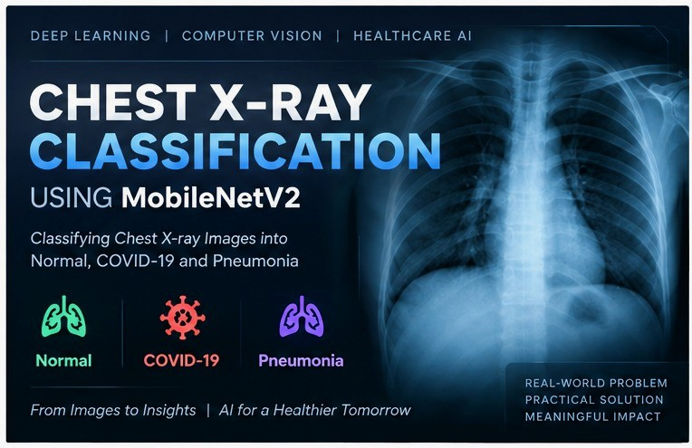
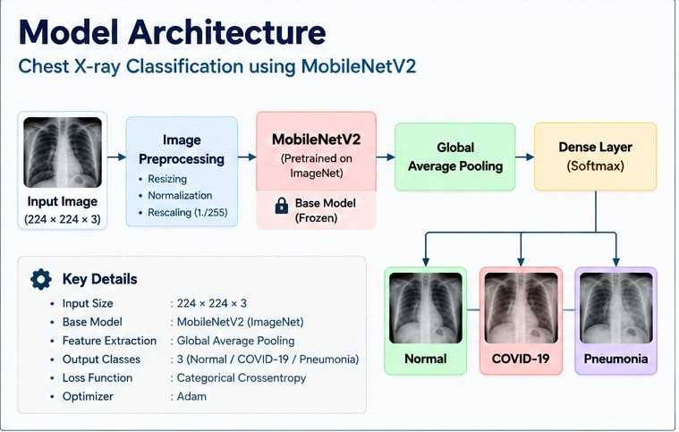
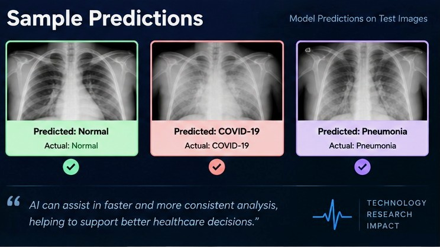

<p align="center">
  
</p>

<p align="center">
  <strong>Deep Learning · Computer Vision · Medical Image Classification</strong>
</p>

<p align="center">
  A deep learning project that classifies chest X-ray images into
  Normal, COVID-19, and Pneumonia categories using MobileNetV2 transfer learning.
</p>

<p align="center">
  <a href="notebook/Chest-X-Ray-Classification.ipynb">View Notebook</a>
  &nbsp;&nbsp;•&nbsp;&nbsp;
  <a href="https://www.kaggle.com/datasets/prashant268/chest-xray-covid19-pneumonia">Dataset</a>
</p>

---

## Overview

This project explores chest X-ray image classification using **MobileNetV2**, a convolutional neural network pretrained on ImageNet.

The model is used to classify chest X-ray images into three categories:

- Normal
- COVID-19
- Pneumonia

The project covers image preprocessing, transfer learning, model training, evaluation, and visual analysis of predictions.

---

## Model Architecture

The classification pipeline is built around MobileNetV2 transfer learning.

<p align="center">
  
</p>

### Architecture Components

| Component | Configuration |
|---|---|
| Base Model | MobileNetV2 |
| Pretrained Weights | ImageNet |
| Input Size | 224 × 224 × 3 |
| Feature Extraction | Global Average Pooling |
| Output Classes | 3 |
| Optimizer | Adam |
| Loss Function | Categorical Crossentropy |

---

## Results & Visual Analysis

The notebook contains the model evaluation workflow and visual analysis of predictions.

<p align="center">
  
</p>

The project focuses on understanding how a transfer-learning-based image classifier performs across the three target categories.

---

## Dataset

The project uses a chest X-ray dataset containing images belonging to:

- Normal
- COVID-19
- Pneumonia

Dataset source:

**Chest X-Ray COVID-19 Pneumonia Dataset — Kaggle**

---

## Technologies

### Programming

- Python

### Machine Learning & Deep Learning

- TensorFlow
- Keras
- MobileNetV2
- Scikit-learn

### Data & Visualization

- NumPy
- Pandas
- Matplotlib
- Seaborn

### Development

- Jupyter Notebook
- Git
- GitHub

---

## Project Workflow

```text
Chest X-ray Dataset
        │
        ▼
Image Preprocessing
        │
        ▼
MobileNetV2
Pretrained on ImageNet
        │
        ▼
Feature Extraction
        │
        ▼
Global Average Pooling
        │
        ▼
Classification Layer
        │
        ▼
┌──────────┬──────────┬────────────┐
│  Normal  │ COVID-19 │ Pneumonia  │
└──────────┴──────────┴────────────┘
